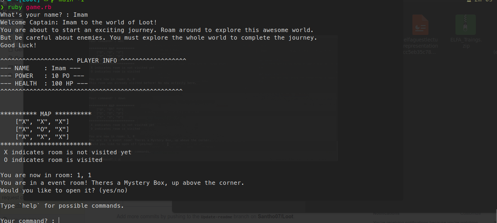

# Loot

A text based cli adventure game built with Ruby!

## Prerequisite

 - Ruby Version >= 2.0

## How to run the game

 - Clone the project
 - Run `ruby game.rb` from the root directory

Please maximize your terminal while playing the game to get a better experience.

## Tests

Tests are written using RSpec.

To run the tests:
 - Run `bundle install`
 - Run `bundle e rspec`

## Credits

Written by Imam Hossain

* Email: imam.swe@gmail.com

## Copyright

Copyright (C) 2022 Loot, All Rights Reserved.
